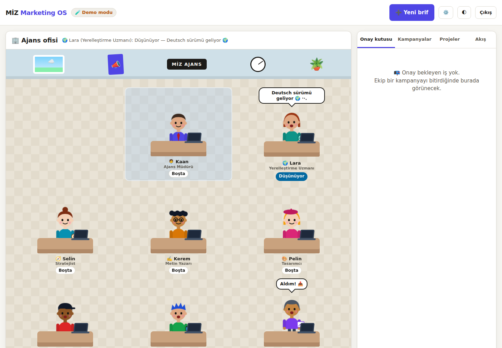
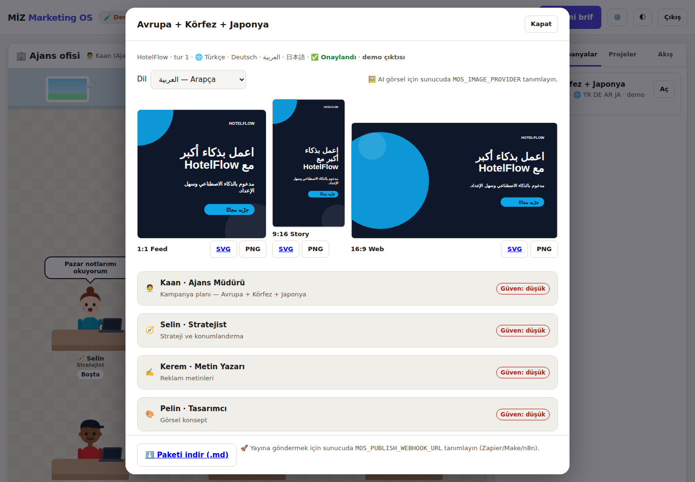
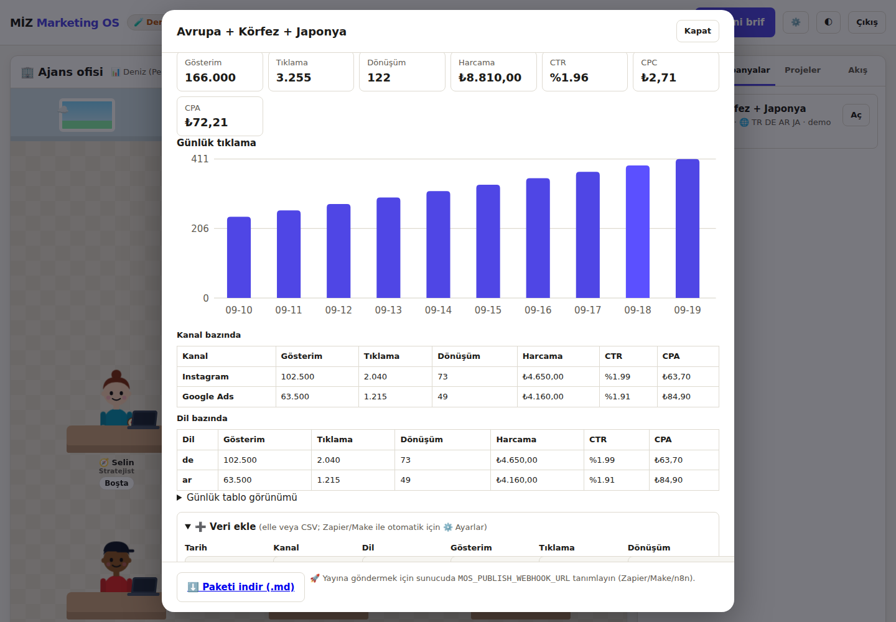

# 🏢 MİZ Marketing OS

My İnovatif Zeka'nın tüm projeleri (HotelFlow, DurakAI, ZEKAI Travel, MediTour, FinFlow ve yenileri) için
**AI reklam ajansı**. Ekip çalışır, siz ekranda çizgi film karakterleri olarak izlersiniz, **sadece onaylarsınız**.



## Ekip

| Karakter | Rol | Ne yapar |
|---|---|---|
| 🧑‍💼 Kaan | Ajans Müdürü | Brifi okur, planlar, en sonda kalite kontrol + yönetici özeti |
| 🧭 Selin | Stratejist | Hedef kitle, konumlandırma, mesaj sütunları, kanal önceliği |
| ✍️ Kerem | Metin Yazarı | Başlıklar, reklam metinleri, CTA, slogan |
| 🎨 Pelin | Tasarımcı | Görsel konsept, renkler, **canlı reklam maketi**, görsel üretim komutu |
| 🎬 Ali | Reklam Yönetmeni | 15 sn / 30 sn video storyboard |
| 📱 Tuna | Sosyal Medya Uzmanı | 2 haftalık içerik takvimi |
| 📊 Deniz | Performans Analisti | KPI, UTM, A/B testleri; yayın sonrası **gerçek veriden** rapor |
| 🌍 Lara | Yerelleştirme Uzmanı | Her hedef dil için transcreation + kültürel notlar + Türkçe geri çeviri |

## Akış

```
Yeni brif (+ diller) → Kaan planlar → Selin → Kerem → Pelin → Ali → Tuna → Deniz
         → Lara (her dil: DE, EN, FR, IT, AR, FA, ZH, JA…) → Kaan son kontrol
         → 🟠 Onay kutusu → Siz: ✅ Onayla | 🔁 Revize iste (notla, yeni tur) | ❌ Reddet
         → Onaylanan paket .md olarak indirilir
         → 🎨 Kreatifler: her dilde 1:1, 9:16, 16:9 (SVG/PNG) + isteğe bağlı AI görsel
         → 📈 Ölçüm (elle / CSV / Zapier) → 📊 Deniz'in raporu
         → 🚀 Yayın aracına gönder (sizin tıklamanız + teyit) → Zapier/Make/n8n → Meta/Buffer/Google Ads TASLAĞI
```

Ekranda: sıradaki karakter düşünür (…), klavyede yazar, işini bitirince zıplayıp konuşur ve
📄 evrakı bir sonraki masaya fırlatır. Onay beklerken müdür el sallar. Boştaki karakterler kendi kendine konuşur.
Sağ panelde onay kutusu, kampanyalar, projeler ve canlı akış.

## Kurulum (yerel / Windows / Mac)

```bash
cd marketing-os
npm install
npm start            # http://localhost:4000
```

İlk açılışta konsolda **yönetici parolası** yazılır (bir kez). Kendiniz belirlemek için:

```bash
# Mac/Linux
MOS_ADMIN_PASSWORD='güçlü-bir-parola' ANTHROPIC_API_KEY='sk-ant-...' npm start
# Windows PowerShell
$env:MOS_ADMIN_PASSWORD='güçlü-bir-parola'; $env:ANTHROPIC_API_KEY='sk-ant-...'; npm start
```

- `ANTHROPIC_API_KEY` **yoksa → Demo modu**: ofis ve onay akışı çalışır, çıktılar açıkça "DEMO" etiketli şablondur.
- Anahtar **varsa → AI modu**: her karakter Claude ile gerçek içerik üretir (varsayılan model `claude-opus-5`, `MOS_MODEL` ile değişir).
- Tüm ayarlar: `.env.example`.

## Diller

Brifte yayın dillerini seçin: Türkçe, İngilizce, Almanca, Fransızca, İtalyanca, İspanyolca, Rusça, Hollandaca,
Lehçe, **Arapça**, **Farsça**, **Çince (Basitleştirilmiş)**, **Japonca**, Korece. Türkçe her zaman dahildir
(onay dili). Ana iş Türkçe hazırlanır; ardından 🌍 Lara her dil için ayrı bir uyarlama (transcreation) yapar:
başlıklar, metinler, CTA, video dış sesi, sosyal gönderiler, hashtag'ler + Türkçe **kültürel notlar** ve
başlık/CTA'nın **Türkçe geri çevirisi** (anlamadığınız dili de kontrol edebilesiniz diye).

- Arapça/Farsça kreatifler **sağdan sola** dizilir (metin sağa hizalı, süsler aynalanır).
- Çince/Japonca/Korece satır kırma karakter bazındadır; marka adları bölünmez, satır başına noktalama gelmez.
- PNG dönüştürme tarayıcıda yapılır; Arapça/CJK yazı tipleri cihazınızda yoksa SVG'yi kullanın.
- Demo modunda diller için yalnızca elle doğrulanmış kısa örnek ifadeler gösterilir.



## Kreatifler

Pelin'in maketinden sunucuda 3 format üretilir: **1:1** (1080×1080), **9:16** (1080×1920), **16:9** (1920×1080).
Kampanya ekranında önizlenir; **SVG** (sunucudan) veya **PNG** (tarayıcıda) indirilir.
Metin rengi arka planla WCAG AA (4,5:1) kontrastı sağlamıyorsa otomatik okunur renge çekilir.

### AI görsel (isteğe bağlı)

Claude görsel üretmez; ayrı bir servis gerekir. `MOS_IMAGE_PROVIDER=openai` (+ `OPENAI_API_KEY`) veya
`MOS_IMAGE_PROVIDER=fal` (+ `FAL_KEY`) tanımlayın. Kampanyada **🖼️ AI görsel üret** (teyitli, ücretli olabilir)
Pelin'in görsel komutundan yazısız bir görsel üretir; kreatiflere metnin üstüne binmeyecek şekilde yerleşir.

## Web sitesinden marka bilgisi

**Projeler → Düzenle → 🌐 Siteden bilgi al**: sitenizin (ör. Hostinger'daki) başlık, açıklama, başlık ve
metinleri okunur ve ajansa **veri** olarak verilir; boş alanlara öneri yazılır, kaydetmek size kalır.
Güvenlik: yalnızca http(s), yerel/özel ağ adresleri engellenir, boyut/süre sınırı var.

## Performans ve rapor



Onaylanan kampanyada **📈 Performans** bölümü: gösterim, tıklama, dönüşüm, harcama, CTR, CPC, CPA; günlük
tıklama grafiği; kanal ve dil tabloları. Veri girişi:
- elle (satır satır) veya **CSV** (`tarih;kanal;dil;gösterim;tıklama;dönüşüm;harcama`),
- otomatik: ⚙️ **Ayarlar**'dan anahtar üretin, Zapier/Make ile `POST /api/ingest/metrics`
  (`Authorization: Bearer <anahtar>`). Anahtarın yalnızca özeti saklanır.

**📊 Deniz'e rapor yazdır** → Deniz yalnızca girilen rakamlarla rapor yazar (rakam uydurmaz), bütçe önerilerini
"öneri" olarak işaretler.

## Yayın köprüsü (Zapier / Make / n8n)

Onaylanan kampanyada **🚀 Yayın aracına gönder (taslak)** düğmesi çıkar. Tıklayıp teyit edince paket
`MOS_PUBLISH_WEBHOOK_URL` adresine JSON olarak gider:

```json
{ "type": "miz.campaign.approved", "publish_as": "draft",
  "campaign": {}, "project": {}, "visual": {},
  "creatives": { "square": { "mime": "image/svg+xml", "svg": "<svg…>" }, "story": {}, "wide": {} },
  "deliverables": [ { "agent": "yazar", "title": "...", "confidence": "high", "body_markdown": "..." } ] }
```

- `MOS_PUBLISH_SECRET` verilirse `X-MOS-Signature: sha256=<HMAC-SHA256(gövde)>` başlığıyla imzalanır; alıcıda doğrulayın.
- Zapier örneği: *Webhooks by Zapier → Catch Hook* → *Buffer: Create Idea* veya Facebook Pages taslak gönderi.
- Hedef araçta **taslak** olarak açın; son "yayınla" yine sizde kalsın.
- Yalnızca **onaylı** kampanya gönderilebilir, aynı kampanya iki kez gönderilemez, her deneme denetime yazılır.
  Hata olursa durum değişmez, ekranda anlaşılır mesaj çıkar.

## Hostinger'a kurulum

Adım adım rehber: **[HOSTINGER.md](HOSTINGER.md)** (Business/Cloud plan, alt alan adı, GitHub dağıtım dalı,
ortam değişkenleri, kalıcı veritabanı yolu, VPS alternatifi).

## Railway / diğer sunucular

1. Root directory: `marketing-os`, start komutu: `npm start`.
2. Değişkenler: `MOS_ADMIN_PASSWORD`, `ANTHROPIC_API_KEY`, `MOS_COOKIE_SECURE=1`, isteğe bağlı `MOS_PUBLISH_WEBHOOK_URL` + `MOS_PUBLISH_SECRET`.
3. Kalıcı disk bağlayıp `MOS_DB_FILE=/data/marketing-os.db` verin (yoksa yeniden dağıtımda veriler silinir).
4. Sağlık kontrolü: `/api/health`.

## Kurallar (AI_PRODUCT_OS)

- **İnsan onayı:** hiçbir ajan yayınlayamaz, bütçe harcayamaz, müşteriye gönderemez. Sadece taslak üretir.
- **Dürüstlük:** fiyat, istatistik, müşteri sayısı uydurmaz; eksik bilgiyi `[bilgi gerekli: …]` diye işaretler.
  Her teslimat bir **güven** etiketi taşır (yüksek/orta/düşük). Proje açıklamalarını “Projeler” sekmesinden doldurun.
- **Gizli anahtarlar** yalnızca sunucu ortamında; tarayıcıya hiç gitmez. Oturum HttpOnly çerezde, parola scrypt ile saklanır.
- **Kiracı izolasyonu:** her satırda `organization_id`, her sorgu bunu oturumdan alır.
- **Denetim kaydı:** giriş, proje/site içe aktarma, kampanya, onay/revizyon/red, görsel üretimi, yayın, ölçüm, yedek → `audit` tablosu.
- **Yedek:** ⚙️ Ayarlar → veritabanı yedeğini indir (tutarlı anlık kopya, yalnızca hesap sahibi).
- **Erişilebilirlik:** klavyeyle sekmeler, ekran okuyucu için canlı durum duyurusu, durumlar renk + metinle, hareket azaltma tercihine uyum, açık/koyu tema.

## Test

```bash
npm test   # akış, revizyon, onay, kiracı izolasyonu, kreatif kontrastı, yayın + imza,
           # çok dilli (RTL/CJK), site içe aktarma + SSRF, AI görsel, ölçüm + rapor, yedek
```

## Sonraki adımlar (bilinçli olarak dışarıda bırakıldı)

- Reklam platformlarına (Meta/Google Ads) doğrudan OAuth bağlantısı — şimdilik Zapier/Make köprüsü üzerinden.
- Uygulama arayüzünün kendisinin çok dilli olması (şu an Türkçe; kampanyalar çok dilli).
- Çoklu kullanıcı / rol yönetimi arayüzü, otomatik yedekleme.
